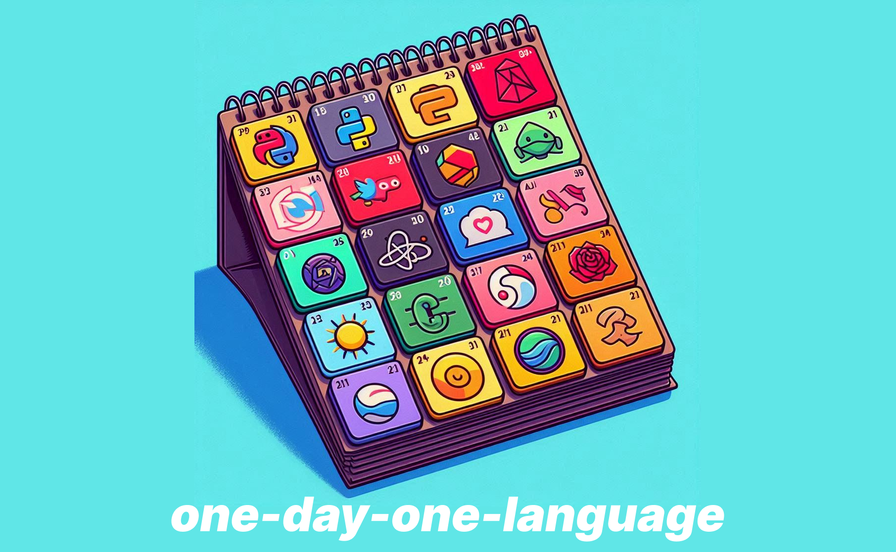

# UN DÍA, UN LENGUAJE
## Este es un proyecto para ayudar a los nuevos programadores

# Introducción
Este recurso está diseñado para quienes desean aprender o explorar un lenguaje de programación específico. Lo hemos llamado "Un día, un lenguaje" porque cada sesión se centra en enseñar la sintaxis de un lenguaje de programación diferente y culmina con un reto de programación que pondrá a prueba tus nuevos conocimientos.

Aprender un lenguaje de programación en profundidad requiere dedicación y esfuerzo continuos, no es algo que se logre en un solo día.
Recuerda siempre: sin dolor no hay gloria. Cada desafío que enfrentas te acerca más a dominar el arte de la programación.
##### Que comience el juego... :ghost:

# Calendario
###  Día 1: Python

## [Código](https://github.com/theLuckyhouse/one-day-one-language/blob/main/Dia%201%20%23Python/python.py)
**Recursos:** [Web oficial](https://www.python.org) | [Editor en línea](https://www.online-python.com/) | [Configuración](https://www.python.org/downloads/) | [Documentación](https://docs.python.org/es/3/) 
